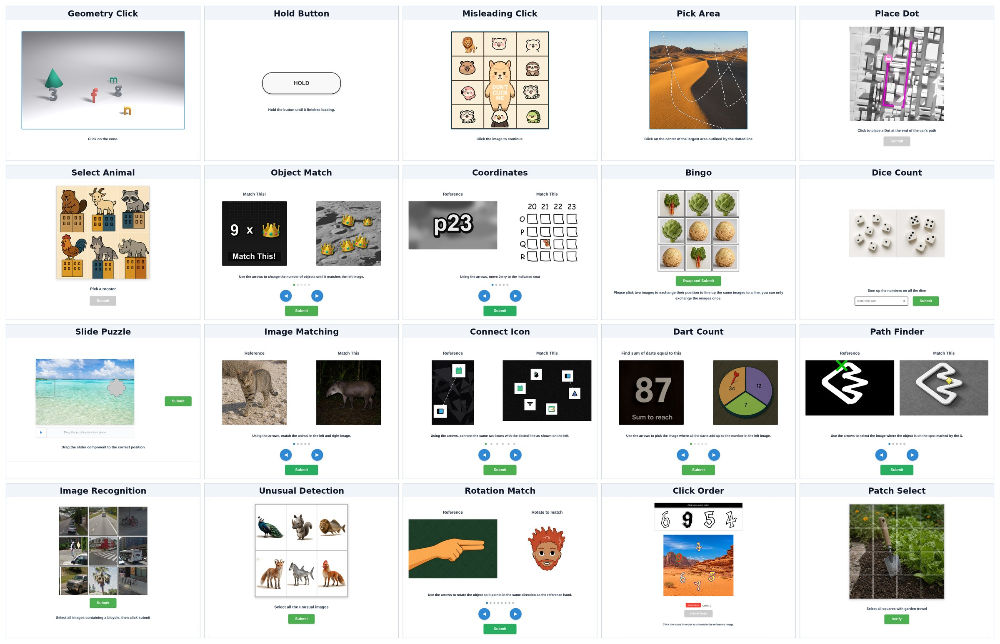
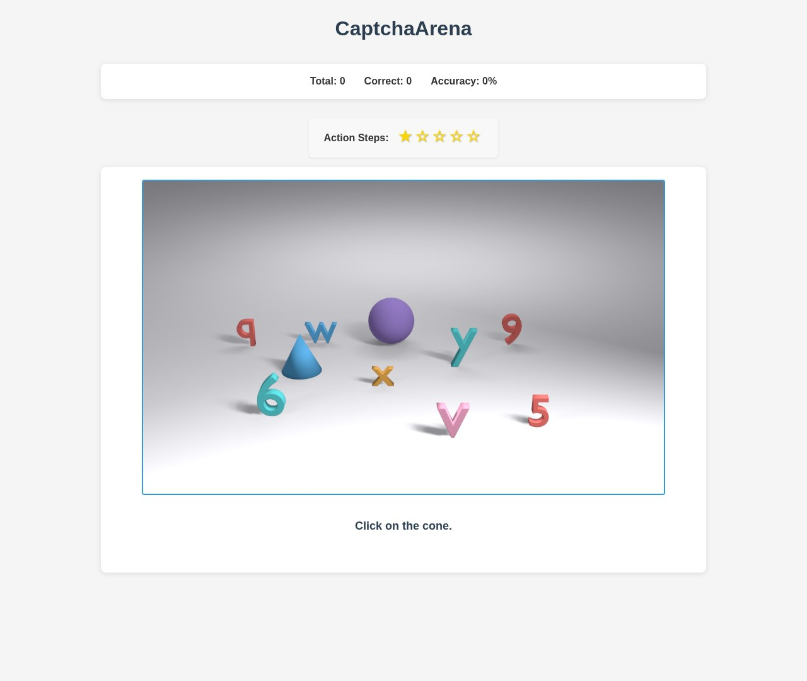
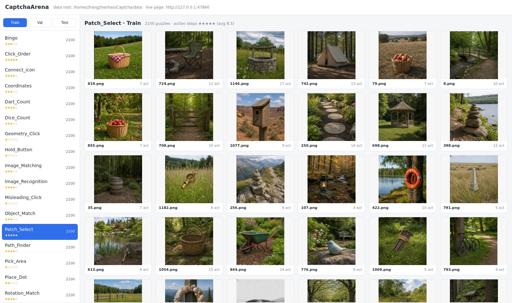
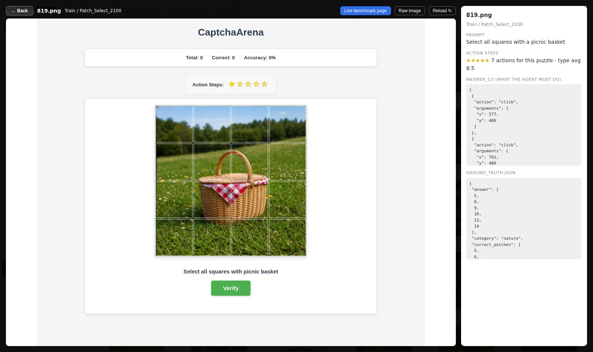

# CaptchaArena

**A benchmark for computer-use agents on interactive CAPTCHAs.**

<p align="center">
  <a href="LICENSE"></a>
  <a href="https://www.python.org"></a>
  <a href="https://huggingface.co/datasets/ZHEN-04/CaptchaArena"></a>
</p>



CaptchaArena serves 20 families of modern CAPTCHA as live web pages at a fixed
1280x1080 viewport. An agent gets screenshots and nothing else; it answers by moving the
mouse and typing, and the page's own checker decides whether it was right. 50,000 puzzles
ship across `Train` / `Val` / `Test`, each one carrying a machine-executable solution, so
a whole split can be replayed and verified without ever calling a model.

## Table of Contents

- [Why a live page](#why-a-live-page)
- [The 20 puzzle types](#the-20-puzzle-types)
- [Ground truth](#ground-truth)
- [Repository layout](#repository-layout)
- [Setup](#setup)
- [Getting the data](#getting-the-data)
- [Running it](#running-it)
- [Browsing the dataset](#browsing-the-dataset)
- [Release status](#release-status)
- [License](#license)
- [Credits](#credits)

## Why a live page

A CAPTCHA is not a labelling problem. Almost none of the interesting ones can be answered
by looking: you step an object round with arrow buttons until it lines up, you drag a
slider until the notch catches, you swap two tiles, you hold a button down and wait, you
click a spot that only exists after the page has laid itself out. Flatten that into a
static image plus a text answer and the part that is actually hard disappears.

So CaptchaArena keeps the page:

- **Rendered, not pre-baked.** Flask serves every puzzle and a real browser draws it at a
  locked 1280x1080 viewport, which is what makes pixel coordinates comparable between two
  models, or between the same model on two different days.
- **Screenshot in, mouse out.** The agent's whole observation is a screenshot, and its
  whole action space is five tools — `screenshot`, `click`, `drag`, `type_text` and
  `hold`. There is no `done`: submitting ends the episode. It is given no puzzle
  metadata, no DOM, and no benchmark API.
- **Graded by the page.** Correctness comes from `/api/check_answer`, the same endpoint a
  human clicking Submit goes through. There is no separate offline scorer to drift from.
- **Multi-step by nature.** Reference solutions run from one action to 22. Seventeen of
  the twenty categories need at most six; `Unusual_Detection` and `Rotation_Match` reach
  seven and eight; `Patch_Select` is the long tail, with a median of 8 and a 90th
  percentile of 12. A score therefore reflects perception, grounding *and* ordering
  rather than a single guess.

## The 20 puzzle types

The instruction column is the literal text rendered on the page. "Actions" is the mean
length of the ground-truth solution measured over the `Test` split; the benchmark page
shows the same number as a 1–5 star rating.

| Type | Interaction | Instruction on the page | Actions |
|---|---|---|---|
| `Geometry_Click` | click | *Click on the cone.* | 1.0 |
| `Hold_Button` | press and hold | *Hold the button until it finishes loading.* | 1.0 |
| `Misleading_Click` | click | *Click the image to continue.* | 1.0 |
| `Pick_Area` | click | *Click on the center of the largest area outlined by the dotted line* | 1.0 |
| `Place_Dot` | click, submit | *Click to place a Dot at the end of the car's path* | 2.0 |
| `Select_Animal` | click, submit | *Pick a rooster* | 2.0 |
| `Object_Match` | arrow cycling | *Use the arrows to change the number of objects until it matches the left image.* | 2.8 |
| `Coordinates` | arrow cycling | *Using the arrows, move Jerry to the indicated seat* | 2.8 |
| `Bingo` | tile swap | *...click two images to exchange their position to line up the same images to a line* | 3.0 |
| `Dice_Count` | type a number | *Sum up the numbers on all the dice* | 3.0 |
| `Slide_Puzzle` | drag | *Drag the slider component to the correct position* | 3.0 |
| `Image_Matching` | arrow cycling | *Using the arrows, match the animal in the left and right image.* | 3.1 |
| `Connect_icon` | arrow cycling | *Using the arrows, connect the same two icons with the dotted line as shown on the left.* | 3.5 |
| `Dart_Count` | arrow cycling | *Use the arrows to pick the image where all the darts add up to the number in the left image.* | 3.7 |
| `Path_Finder` | arrow cycling | *Use the arrows to select the image where the object is on the spot marked by the X.* | 3.7 |
| `Image_Recognition` | grid multi-select | *Select all images containing a bicycle, then click submit* | 4.4 |
| `Unusual_Detection` | grid multi-select | *Select all the unusual images* | 4.5 |
| `Rotation_Match` | arrow cycling | *Use the arrows to rotate the object so it points in the same direction as the reference hand.* | 4.5 |
| `Click_Order` | ordered clicks | *Click the icons in order as shown in the reference image.* | 5.1 |
| `Patch_Select` | grid multi-select | *Select all squares with garden trowel* | 8.5 |

Seven of the types share one arrow-cycling widget: a left and a right button that page
through candidate images. They look alike and behave alike, but the underlying decision —
count darts, match a rotation, follow a path — is different in each, which makes them a
useful controlled comparison.

## Ground truth

Every puzzle directory carries two files:

- `ground_truth.json` — the answer in its raw form (indices, coordinates, text) with the
  `tolerance` used when grading it.
- `ground_truth_cu.json` — the same answer written out as agent actions:

```jsonc
"answer_cu": [
  {"action": "click", "arguments": {"x": 619, "y": 132}},
  {"action": "click", "arguments": {"x": 640, "y": 924}}
]
```

The second form is executable, which is the point. The bundled `mock` provider drives a
browser through `answer_cu` and submits to the real grader, so a split can prove itself:
anything short of 100% is a defect in the data, not in a model. We use it as a gate before
publishing any regenerated split.

Spatial answers are stored in **image-natural pixels**, origin top-left. The frontend
scale-corrects clicks back into that frame, so the stored answer stays valid however the
image is displayed.

## Repository layout

```
CaptchaArena/
├── app.py                    # Flask server: serves puzzle pages, grades answers
├── agent_frameworks/
│   └── computeruse_cli.py    # the screenshot agent (anthropic / openai / google / mock)
├── templates/ static/        # the benchmark page itself
├── gallery/
│   └── app.py                # dataset browser: thumbnails + live puzzle pages
├── web/                      # React viewer for agent runs and trajectories
├── data/                     # where the downloaded dataset goes (see data/README.md)
├── requirements.txt
└── Dockerfile
```

## Setup

```bash
pip install -r requirements.txt
playwright install chromium
```

The server and the agent both run on Python 3.10+.

## Getting the data

Images and ground truth live on the Hugging Face Hub:

**https://huggingface.co/datasets/ZHEN-04/CaptchaArena**

```bash
pip install -U huggingface_hub
huggingface-cli download ZHEN-04/CaptchaArena --repo-type dataset --local-dir data
```

| Split | Per type | Total |
|---|---|---|
| `Train` | 2,100 | 42,000 |
| `Val` | 200 | 4,000 |
| `Test` | 200 | 4,000 |

Directory names carry their size (`Train/Bingo_2100`, `Test/Bingo_200`), and that
suffixed name is what the API expects as `puzzle_type`. [data/README.md](data/README.md)
has the full layout.

## Running it

### 1. Serve the puzzles

```bash
CAPTCHA_DATA_DIRS=data/Test python app.py       # http://127.0.0.1:7860
```

Jump straight to one puzzle:

```
http://127.0.0.1:7860/?single_puzzle=true&puzzle_type=Geometry_Click_200&puzzle_id=image1.png
```



### 2. Point an agent at it

```bash
python -m agent_frameworks.computeruse_cli \
  --provider openai --model <model> \
  --openai-base-url <endpoint> --openai-api-key <key> \
  --url http://127.0.0.1:7860 \
  --limit 200 --max-steps 30 --headless \
  --output data/Output/<provider>/<model>
```

`--provider` takes `anthropic`, `google`, `mock`, or `openai` — the last of which is any
endpoint speaking the OpenAI chat-completions protocol, so a locally served checkpoint
under vLLM or SGLang works the same as a hosted API. Every puzzle leaves behind
`metafile.json`, `summary.json`, `trajectory.jsonl` and a `screenshots/` folder.

### 3. Check the data with the mock provider

```bash
python -m agent_frameworks.computeruse_cli --provider mock \
  --url http://127.0.0.1:7860 \
  --puzzle-type Geometry_Click_200 --puzzle-id image1.png \
  --mock-gt-dir data/Test --output /tmp/mockrun --headless
```

No model is involved; the recorded actions are replayed in the browser. It is the quickest
way to confirm a fresh download, a code change, or a regenerated split is intact.

## Browsing the dataset

```bash
GALLERY_DATA_ROOT=data GALLERY_CAPTCHA_URL=http://127.0.0.1:7860 \
  python gallery/app.py                         # http://127.0.0.1:48040
```

Split and type on the left, thumbnails on the right.



Clicking a thumbnail does not open a picture — it opens that puzzle's *live* page beside
its ground truth, so you can try it yourself under exactly the conditions an agent faces.



## Release status

What is out, and what is still coming.

- [x] **Benchmark and agent** — this repository: the server, the 20 puzzle families, the
      screenshot agent, the dataset gallery and the trajectory viewer.
- [x] **Dataset** — `Train` / `Val` / `Test`, both ground-truth formats,
      [on the Hub](https://huggingface.co/datasets/ZHEN-04/CaptchaArena) under CC BY 4.0.
- [ ] **SFT data** — the distilled trajectories we fine-tune on, split one sample per
      turn, in plain and reasoning-annotated variants.
- [ ] **Model weights** — the fine-tuned checkpoints.
- [ ] **Training code** — supervised fine-tuning, plus the multi-turn RL setup that
      drives this environment as a live rollout target.
- [ ] **Puzzle generators** — the scripts that render each family, for anyone who wants
      more data than the shipped splits, or a new puzzle type.
- [ ] **Human baseline** — annotators solving the whole `Test` split through this same
      page, so agent scores have something to be measured against.
- [ ] **Paper**, and the baseline numbers that belong with it.

## License

MIT — see [LICENSE](LICENSE). The dataset is released separately under CC BY 4.0.

## Credits

`app.py`, the page template and the frontend script began as
[OpenCaptchaWorld](https://github.com/MetaAgentX/OpenCaptchaWorld) and are redistributed
here under its MIT license. The generators, all shipped puzzle data, the computer-use
agent, the gallery and the trajectory viewer were written for this project.
