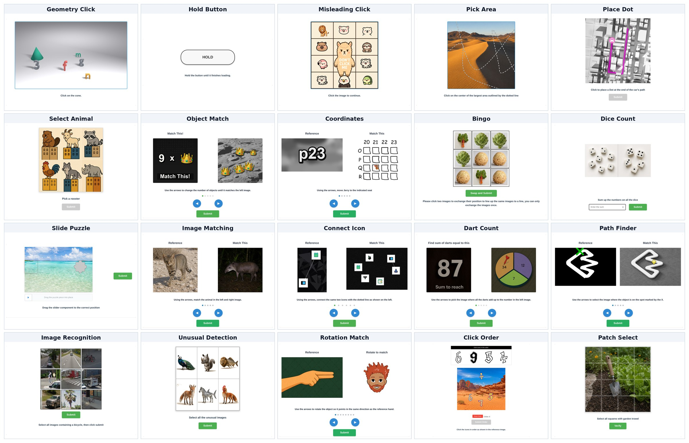
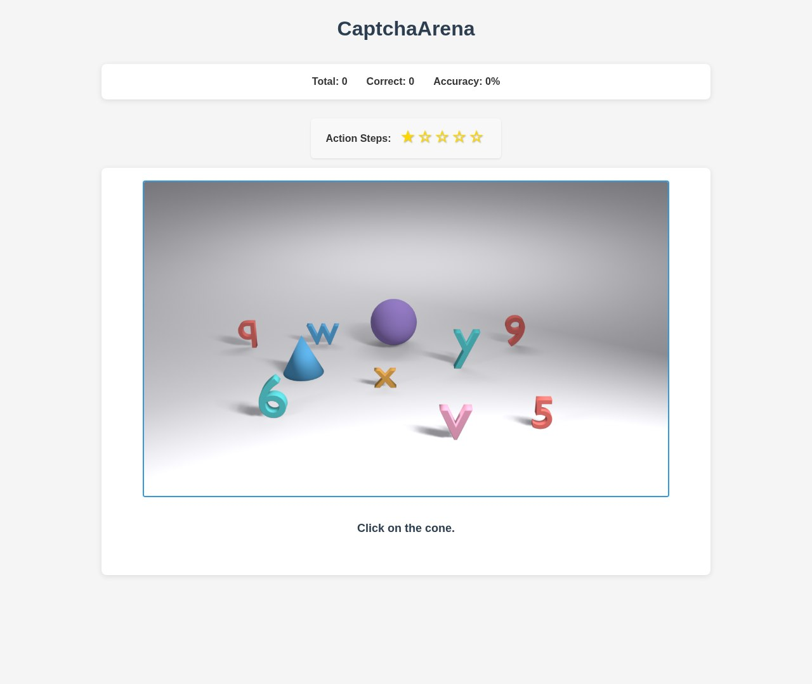
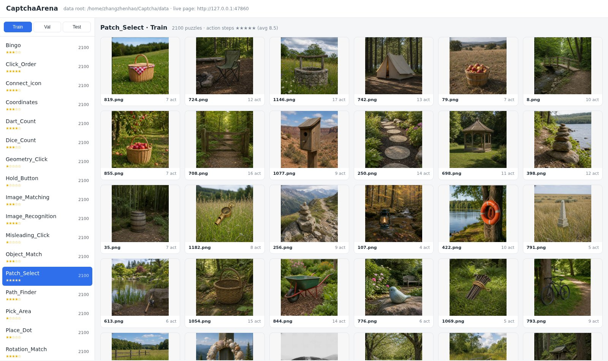
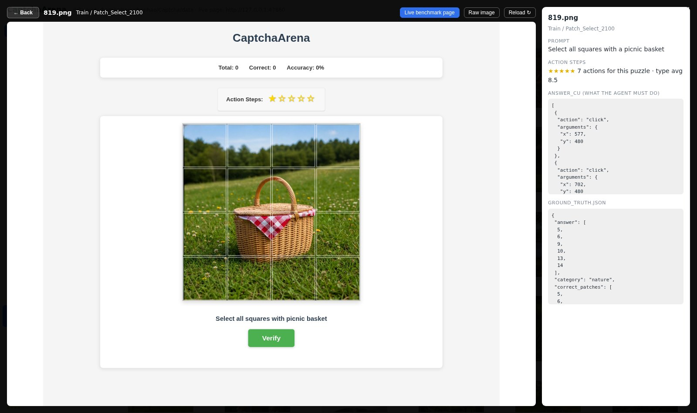

# CaptchaArena

<p align="center"><b>A Large-Scale, Fine-Grained Dataset for Training Computer-Use Agents on Interactive CAPTCHAs</b></p>

<p align="center">
  <a href="https://x0x0x00.github.io/">Zhenhao Zhang</a><sup>1,*</sup>, Zhaoyu Fan<sup>2</sup>, Haohan Ying<sup>3</sup>, Jingwen Hu<sup>3</sup><br>
  Hancen Fan<sup>1</sup>, Junhao Zhou<sup>4</sup>, Zitian Chen<sup>1</sup>, <a href="https://ffmpbgrnn.github.io/">Linchao Zhu</a><sup>2,†</sup><br>
  <sup>1</sup>哥伦比亚大学 &nbsp;·&nbsp; <sup>2</sup>浙江大学 &nbsp;·&nbsp; <sup>3</sup>罗切斯特大学 &nbsp;·&nbsp; <sup>4</sup>伊利诺伊大学厄巴纳-香槟分校<br>
  <sup>*</sup>项目负责人 &nbsp;·&nbsp; <sup>†</sup>通讯作者
</p>

<p align="center">
  <a href="LICENSE"></a>
  <a href="https://www.python.org"></a>
  <a href="https://huggingface.co/datasets/ZHEN-04/CaptchaArena"></a>
  <a href="https://huggingface.co/datasets/ZHEN-04/CaptchaArena-Trajectories"></a>
  <a href="https://arxiv.org/abs/2609.31957"></a>
</p>

<p align="center">
  <a href="README.md">English</a> · <b>简体中文</b>
</p>



这个仓库是 CaptchaArena 的代码部分:把 20 类 CAPTCHA 渲染成真实网页(视口固定 1280×1080)并负责
判分的 Flask 服务器、只靠截图作答的 computer-use agent、在实时页面上浏览数据集的画廊,以及查看
agent 运行与轨迹的界面。

题目和带推理标注的轨迹都在 Hugging Face Hub 上(见[获取数据](#获取数据))。数据集设计、
CaptchaAgent 和全部实验结果见[论文](https://arxiv.org/abs/2609.31957)。

## 更新

- **2026-09-25** —— 论文已上 arXiv:[arXiv:2609.31957](https://arxiv.org/abs/2609.31957)。
- **2026-08-11** —— 轨迹发布:`Train` / `Val` 上带推理标注的轨迹,已上 Hugging Face Hub。
- **2026-08-08** —— 代码发布:基准服务器、截图 agent、数据集画廊、轨迹查看器。
- **2026-08-07** —— 数据集发布:`Train` / `Val` / `Test` 三个划分的题目,已上 Hugging Face Hub。

## 目录

- [更新](#更新)
- [标准答案](#标准答案)
- [仓库结构](#仓库结构)
- [安装](#安装)
- [获取数据](#获取数据)
- [运行](#运行)
- [浏览数据集](#浏览数据集)
- [发布状态](#发布状态)
- [引用](#引用)
- [许可](#许可)
- [致谢](#致谢)
- [联系方式](#联系方式)

## 标准答案

每个题目目录里有两份文件:

- `ground_truth.json` —— 原始形式的答案(索引、坐标、文本),以及判分时用的 `tolerance`。目标
  形状不规则的题型改为给出 `mask_path`,指向一张二值掩码,路径相对题目目录:`Geometry_Click`
  和 `Pick_Area` 放在 `answer.valid_area` 下,`Misleading_Click` 放在顶层。白色(>127)标出
  目标;`Misleading_Click` 则相反,白色标出要避开的角色。
- `ground_truth_cu.json` —— 同一个答案,写成 agent 动作序列(`answer_cu`):

```jsonc
"answer_cu": [
  {"action": "click", "arguments": {"x": 619, "y": 132}},
  {"action": "click", "arguments": {"x": 640, "y": 924}}
]
```

`action` 取 `click`、`drag`、`type_text`、`hold` 之一,`arguments` 与 agent 工具的参数相同
(`x`/`y`;`start_x`、`start_y`、`end_x`、`end_y`;`text`;可选的 `duration_ms`)。`Bingo` 和
箭头翻页类题型的 `answer_cu` 是一个"备选序列列表"而不是单个序列,重放时取第一个。
`Geometry_Click`、`Pick_Area`、`Misleading_Click`、`Hold_Button` 由页面自动提交,所以它们的
序列末尾没有提交点击。

`answer_cu` 就是 `mock` provider 重放并提交给真实判分器的内容,见
[第 3 步](#3-用-mock-provider-检查数据)。完好的划分应得到 100%。

这里有两套坐标系。`ground_truth.json` 里的目标和掩码是**图像原始像素**,原点左上;页面会把
图像上的点击换算回该坐标系再判分。上面这种工具调用形式的 `answer_cu` 则是固定 1280×1080
页面的绝对像素,原样执行。`answer_cu_kind` 为 `single_xy`、`multi_xy`、`multi_swap` 或
`drag` 的旧格式条目是图像原始像素,mock 重放会在运行时换算。

## 仓库结构

```
CaptchaArena/
├── app.py                    # Flask 服务器:提供题目页面并判分
├── agent_frameworks/
│   └── computeruse_cli.py    # 截图 agent(anthropic / openai / google / mock)
├── templates/ static/        # 基准页面本身
├── gallery/
│   └── app.py                # 数据集浏览器:缩略图 + 实时题目页
├── web/                      # 查看 agent 运行与轨迹的 React 界面
├── data/                     # 下载的数据集放这里(见 data/README.md)
├── requirements.txt
└── Dockerfile
```

## 安装

```bash
pip install -r requirements.txt
playwright install chromium
```

服务器和 agent 都需要 Python 3.10+。

服务器也可以用自带的 `Dockerfile` 跑:镜像里有代码和 Chromium,数据集需要挂载到 `/app/data`:

```bash
docker build -t captcha-arena .
docker run -p 7860:7860 -v "$PWD/data:/app/data" captcha-arena    # serves data/Test
```

加 `-e CAPTCHA_DATA_DIRS=data/Val` 可以换成别的划分。

## 获取数据

两个数据集都在 Hugging Face Hub 上,均为 gated + CC BY-NC 4.0 —— 先到数据集页面申请访问权限,
然后 `hf auth login`。

- **题目** —— [ZHEN-04/CaptchaArena](https://huggingface.co/datasets/ZHEN-04/CaptchaArena)
  · `Train` / `Val` / `Test` 的图片与标准答案
- **轨迹** —— [ZHEN-04/CaptchaArena-Trajectories](https://huggingface.co/datasets/ZHEN-04/CaptchaArena-Trajectories)
  · `Train` / `Val` 上已解出的带思维链轨迹,用于微调

```bash
hf download ZHEN-04/CaptchaArena --repo-type dataset --local-dir data
```

有一点数据集卡片上没说:API 要的 `puzzle_type` 就是带数量后缀的目录名(`Train/Bingo_2100`、
`Test/Bingo_200`),而不是 `Bingo`。详见 [data/README.md](data/README.md)。

## 运行

### 1. 起题目服务

```bash
CAPTCHA_DATA_DIRS=data/Test python app.py       # http://127.0.0.1:7860
```

直接打开某一道题:

```
http://127.0.0.1:7860/?single_puzzle=true&puzzle_type=Geometry_Click_200&puzzle_id=image1.png
```



### 2. 把 agent 指过去

```bash
python -m agent_frameworks.computeruse_cli \
  --provider openai --model <model> \
  --openai-base-url <endpoint> --openai-api-key <key> \
  --url http://127.0.0.1:7860 \
  --per-puzzle --limit 0 --max-steps 15 --headless \
  --output data/Output/<provider>/<model>
```

`--provider` 可选 `anthropic`、`google`、`mock` 或 `openai` —— 最后一个指任何讲 OpenAI
chat-completions 协议的端点,所以用 vLLM 或 SGLang 本地部署的 ckpt 和托管 API 用法完全一样。
`anthropic` 和 `google` 从环境变量读 `ANTHROPIC_API_KEY` 和 `GOOGLE_API_KEY`;其余可调项见
`.env.example`(代码不会加载 `.env`,需要什么自己 export)。

`--per-puzzle` 会把服务器列出的每道题都跑一遍,每道题一个全新的浏览器上下文;`--limit 0`
表示全部,`--max-steps 15` 是论文使用的步数上限。用同一个 `--output` 重跑会跳过已经有
`summary.json` 的题目;`--shard i/N` 把题目列表切给 N 个进程写同一个 `--output`,
`--rollouts N` 把每道题跑 N 次,写到 `rollout_<n>/`。

用 `openai` 或 `mock` 时,每道题写到 `<output>/<type>/<Type>_<id>/` —— `metafile.json`、
`summary.json`、`trajectory.jsonl` 和一个 `screenshots/` 目录 —— 整轮结果写到
`<output>/run_summary.json`。`anthropic` 和 `google` 两条循环只打印结果,不往 `--output`
下写任何文件。

### 3. 用 mock provider 检查数据

```bash
python -m agent_frameworks.computeruse_cli --provider mock \
  --url http://127.0.0.1:7860 \
  --puzzle-type Geometry_Click_200 --puzzle-id image1.png \
  --mock-gt-dir data/Test --output /tmp/mockrun --headless
```

全程不涉及模型,只是把记录好的动作在浏览器里重放一遍。要重放整个划分,去掉
`--puzzle-type`/`--puzzle-id`,加上 `--per-puzzle --limit 0`;`<output>/run_summary.json`
里的 `accuracy` 应当是 `100.0`:

```bash
python -m agent_frameworks.computeruse_cli --provider mock \
  --url http://127.0.0.1:7860 --per-puzzle --limit 0 \
  --mock-gt-dir data/Test --output /tmp/mockrun --headless
```

### 4. 查看运行结果

```bash
cd web && npm install
VITE_CAPTCHA_SERVER_URL=http://127.0.0.1:7860 npm run dev    # http://127.0.0.1:5173
```

需要 Node.js。**Output Runs** 列出 `data/Output/<provider>/<model>/` 下的全部运行(即第 2 步
的 `--output`;可用 `CAPTCHA_RUNS_ROOT` 改),可逐步查看每条轨迹。**Dataset** 在实时页面上浏览
`data/` 下的各个划分(`CAPTCHA_DATA_ROOT`),页面由第 1 步的服务器提供;不设
`VITE_CAPTCHA_SERVER_URL` 时它会到 47860 端口找这个服务器。

## 浏览数据集

```bash
GALLERY_DATA_ROOT=data GALLERY_CAPTCHA_URL=http://127.0.0.1:7860 \
  python gallery/app.py                         # http://127.0.0.1:48040
```

左边选划分和类型,右边是缩略图。



点缩略图会打开那道题的实时基准页面,旁边并排显示标准答案;*Raw image* 开关可以切换成只看原图。
实时页面是从 `GALLERY_CAPTCHA_URL` 反向代理来的,所以第 1 步的服务器必须在跑;它到
`CAPTCHA_DATASET_ROOT/<split>/`(默认 `data`)下找题目,与 `CAPTCHA_DATA_DIRS` 无关。



## 发布状态

已经放出来的,和还没放的。

- [x] **基准与 agent** —— 本仓库:服务器、20 类题目、截图 agent、数据集画廊、轨迹查看器。
- [x] **数据集** —— `Train` / `Val` / `Test` 题目及两份标准答案文件,
      [已上 Hub](https://huggingface.co/datasets/ZHEN-04/CaptchaArena)。
- [x] **训练轨迹** —— `Train` / `Val` 上带推理标注的轨迹,每题一条,
      [已上 Hub](https://huggingface.co/datasets/ZHEN-04/CaptchaArena-Trajectories)。
- [x] **论文** —— [arXiv:2609.31957](https://arxiv.org/abs/2609.31957)。
- [ ] **CaptchaAgent 权重** —— SFT 之后与 GRPO 之后的 Qwen3.5-9B ckpt。
- [ ] **训练代码** —— 监督微调,以及把本环境当作实时 rollout 目标的多轮 GRPO 配置
      (配置见论文附录 K 和 L)。
- [ ] **题目生成器** —— 各类题目的渲染脚本。
- [ ] **人类基线数据** —— 两位标注者通过同一个页面做完整个 `Test` 划分的逐题记录
      (实验页面已随 `app.py` 发布,由 `STUDY_STORE` 开关控制)。

## 引用

如果用到了 CaptchaArena,请引用:

```bibtex
@article{zhang2026captchaarena,
  title   = {CaptchaArena: A Large-Scale, Fine-Grained Dataset for Training Computer-Use Agents on Interactive CAPTCHAs},
  author  = {Zhang, Zhenhao and Fan, Zhaoyu and Ying, Haohan and Hu, Jingwen and Fan, Hancen and Zhou, Junhao and Chen, Zitian and Zhu, Linchao},
  journal = {arXiv preprint arXiv:2609.31957},
  year    = {2026}
}
```

## 许可

本仓库的**代码**是 MIT —— 见 [LICENSE](LICENSE)。

**数据集不是**:两个数据集均以 **CC BY-NC 4.0** 发布并设置了访问门槛,仅限非商业学术研究使用。

## 致谢

`app.py`、页面模板和前端脚本最初源自
[OpenCaptchaWorld](https://github.com/MetaAgentX/OpenCaptchaWorld),按其 MIT 许可在此再分发。
生成器、随仓库发布的全部题目数据、computer-use agent、画廊和轨迹查看器均为本项目所写。

## 联系方式

关于基准、数据或论文的问题,欢迎开 issue,或发邮件给张臻昊(Zhenhao Zhang,项目负责人,现于哥伦比亚大学):
zz3530@columbia.edu。个人主页:[x0x0x00.github.io](https://x0x0x00.github.io/) ·
[Google Scholar](https://scholar.google.com/citations?user=yR55AfsAAAAJ) ·
[GitHub](https://github.com/X0X0X00)。
